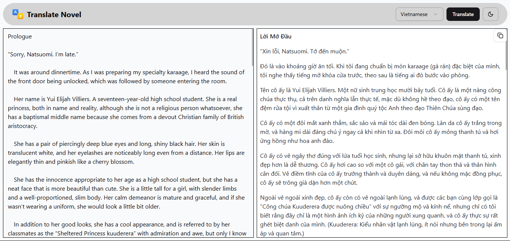

# Translate Novel



## Overview

A web application that helps translate text between different languages using AI models. Built with React and TypeScript.

## Features

- Translate text to multiple languages (default: Vietnamese)
- Real-time translation
- Copy translated text to clipboard
- Dark/Light mode support
- Responsive design

## Tech Stack

- React
- TypeScript
- Tailwind CSS
- Radix UI
- React Hot Toast
- OpenRouter API

## Getting Started

1. Clone the repository:

   ```bash
   git clone https://github.com/vanthom04/translate-novel.git
   cd translate-novel
   ```

2. Install dependencies:

   ```bash
   npm install
   # or
   yarn install
   # or
   pnpm install
   # or
   bun install
   ```

3. Create `.env.local` file in root directory and add your OpenRouter API key:

   ```bash
   VITE_OPEN_ROUTER_API_KEY=your_api_key_here
   ```

4. Start the development server:

   ```bash
   npm run dev
   # or
   yarn dev
   # or
   pnpm dev
   # or
   bun run dev
   ```

5. Open [http://localhost:5000](http://localhost:5000) with your browser to see the result.
